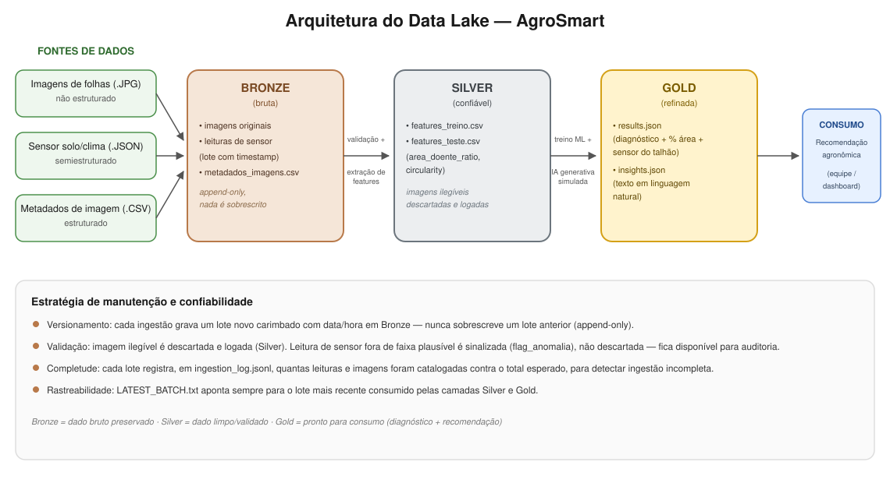

# Data Lake -- Arquitetura e Camadas

**Bronze (bruta):** armazena os dados exatamente como chegam -- imagens
`.JPG` das folhas, sem nenhum processamento, e os arquivos brutos de sensor.
O "estoque de matéria-prima": nada aqui é confiável ainda, só preservado.

**Silver (confiável):** dados limpos, validados e estruturados -- as
features extraídas de cada imagem (`area_doente_ratio`, `circularity`), já
filtradas de erros de leitura (imagem corrompida é descartada e logada).

**Gold (refinada):** dados prontos para consumo direto por sistemas ou
pessoas -- diagnóstico, probabilidade, recomendação e o texto de IA
generativa simulada, tudo em formato consumível.

Detalhes de implementação e da estratégia de manutenção/versionamento em
[README.md](README.md).
