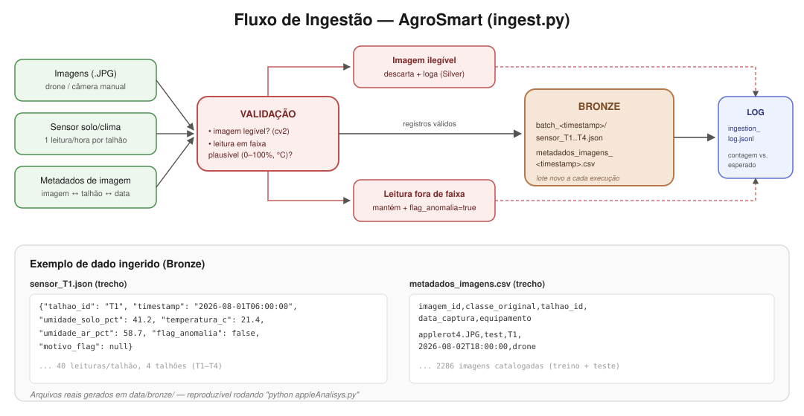

# Ingestão -- Fluxo, Exemplo de Dados e Manutenção



## Fontes simuladas

- **Imagens (.JPG):** já existentes em `data/Apple___healthy/`,
  `data/Apple___Black_rot/` e `test/` -- não estruturado.
- **Sensor de solo/clima:** gerado por `ingest.py`, 1 arquivo `.json` por
  talhão (`T1`-`T4`), com leituras horárias simuladas de
  `umidade_solo_pct`, `temperatura_c` e `umidade_ar_pct`.
- **Metadados de imagem:** um `.csv` ligando cada imagem a um talhão, data
  de captura e equipamento (`drone` / `camera_manual`) -- estruturado.

## Exemplo real de dado ingerido

`data/bronze/sensores/batch_<timestamp>/sensor_T1.json` (um registro):

```json
{
  "talhao_id": "T1",
  "timestamp": "2026-08-01T06:00:00",
  "umidade_solo_pct": 41.2,
  "temperatura_c": 21.4,
  "umidade_ar_pct": 58.7,
  "flag_anomalia": false,
  "motivo_flag": null
}
```

`data/bronze/metadados_imagens_<timestamp>.csv` (trecho):

```csv
imagem_id,classe_original,talhao_id,data_captura,equipamento
applerot4.JPG,test,T1,2026-08-02T18:00:00,drone
```

Esses arquivos são gerados de verdade -- rode `python appleAnalisys.py` (ou
`python ingest.py` isoladamente) e confira em `data/bronze/`.

## Organização e manutenção

- **Versionamento (append-only):** cada execução grava um lote novo
  carimbado com data/hora; nenhum lote anterior é sobrescrito.
  `data/bronze/LATEST_BATCH.txt` aponta para o lote mais recente.
- **Validação:** imagem ilegível é descartada e logada na camada Silver
  (`data/silver/validation_log.txt`). Leitura de sensor fora de faixa
  plausível (ex.: umidade negativa) não é descartada -- é marcada com
  `flag_anomalia: true` e o motivo em `motivo_flag`, para auditoria, em vez
  de esconder uma possível falha real de hardware no campo.
- **Confiabilidade/completude:** `data/bronze/ingestion_log.jsonl` registra,
  por lote, quantas leituras de sensor foram geradas por talhão (e quantas
  flagadas) e quantas imagens foram catalogadas contra o total esperado.

Detalhes completos em [README.md](README.md).
