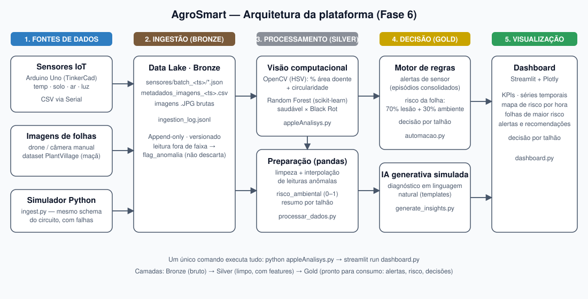

# Entrega 1 — Arquitetura da solução AgroSmart (Fase 6)



Arquivo do diagrama: [`arquitetura_fase6.svg`](arquitetura_fase6.svg)

## Fluxo em uma frase

Sensores e fotos de folhas entram no Data Lake (Bronze), são limpos e transformados em atributos e modelos (Silver), viram alertas, riscos e decisões (Gold) e são apresentados em um dashboard.

## Componentes

| # | Componente | Arquivo | Função |
|---|---|---|---|
| 1 | **Sensores IoT (simulados)** | `iot/agrosmart_sensores/agrosmart_sensores.ino` | Circuito Arduino no TinkerCad com temperatura (TMP36), umidade do solo, luminosidade (LDR) e umidade do ar (potenciômetro). Emite CSV pela Serial e acende LEDs de irrigação e risco fúngico. |
| 2 | **Simulador de sensores** | `ingest.py` | Gera leituras com o mesmo schema do circuito para 4 talhões com cenários distintos (equilibrado, úmido/quente, seco, evento de chuva), com ~5% de falhas propositais. Também cataloga as imagens por talhão, data e equipamento. |
| 3 | **Data Lake – Bronze** | `data/bronze/` | Dados brutos, versionados por lote (append-only): `sensores/batch_<ts>/*.json`, `metadados_imagens_<ts>.csv`, `ingestion_log.jsonl`. Leitura fora da faixa recebe `flag_anomalia`, sem ser descartada. |
| 4 | **Visão computacional + ML** | `appleAnalisys.py` | OpenCV (HSV) mede a % de área doente e a circularidade da folha; um Random Forest classifica saudável × Black Rot. Salva features em `data/silver/`. |
| 5 | **Preparação de dados** | `processar_dados.py` | Limpa leituras anômalas por interpolação (mantendo `valor_imputado`), calcula `risco_ambiental` (0–1), resume por talhão e gera `dataset_dashboard.csv` e `diagnosticos.csv` (Gold). |
| 6 | **Motor de regras (automação)** | `automacao.py` | Gera alertas de sensor consolidados em episódios, classifica o risco de cada folha (70% lesão + 30% ambiente) e decide a ação por talhão. Saídas: `alertas.json/csv`, `risco_folhas.csv`, `acoes_talhao.json`. |
| 7 | **IA generativa simulada** | `generate_insights.py` | Gera o diagnóstico em linguagem natural por folha, combinando classe, confiança, área e condições do talhão (motor de templates, sem API paga). |
| 8 | **Dashboard analítico** | `dashboard.py` | Streamlit + Plotly sobre a camada Gold: KPIs, decisão por talhão, séries temporais, risco por hora, folhas de maior risco, alertas e recomendações. |

## Camadas de dados

- **Bronze:** o dado exatamente como chegou.
- **Silver:** dado limpo e estruturado (`features_*.csv`, `sensores_limpos.csv`, `validation_log.txt`).
- **Gold:** dado pronto para decisão e visualização (`data/gold/`).

## Execução

```bash
pip install -r requirements.txt
python appleAnalisys.py      # ingestão -> ML -> processamento -> automação
streamlit run dashboard.py   # dashboard em http://localhost:8501
```

`python appleAnalisys.py --usar-cache-silver` reaproveita as features de treino já extraídas, sem reler as ~2.000 imagens.

## Decisões de projeto

- **Integração por arquivos na camada Gold:** cada estágio lê a saída do anterior, então qualquer etapa pode ser rodada, testada e demonstrada isoladamente.
- **Mesma fórmula de risco em todo lugar:** texto gerado, classificação da folha e dashboard usam `_risco_ambiental`, então não há divergência entre o que o sistema diz e o que o gráfico mostra.
- **Anomalia não é descartada:** a leitura inválida é corrigida e continua rastreável, porque falha de sensor é informação para a equipe de campo.
