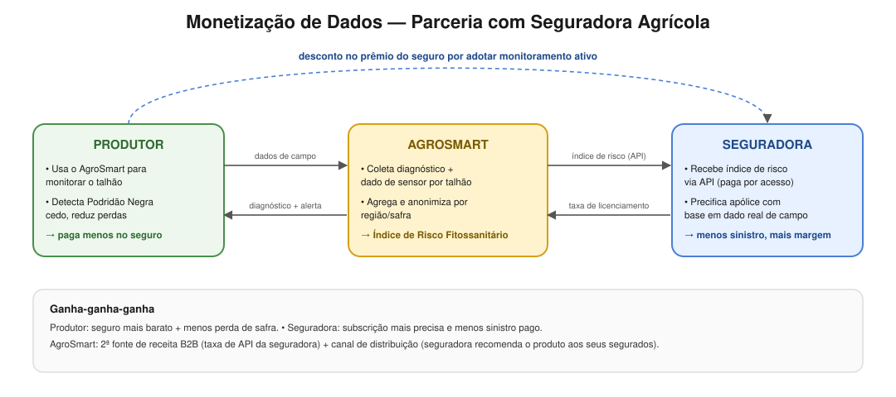

## Proposta de Valor (já fechada, para referência)

**Mapa de Valor**
- Criadores de ganho: tratamento com precisão, aumento de receita e
  produtividade, altamente escalável, melhora a preservação do meio ambiente.
- Produtos e serviços: diagnóstico e análise de saúde de plantas, suporte
  automatizado, descoberta eficaz e veloz de doenças e pragas.
- Aliviam as dores: diminui prejuízos de safra, evita desperdício de
  pesticidas.

**Perfil do Cliente**
- Ganhos: monitoramento em larga escala, análise descritiva com
  call-to-action, real-time application.
- Tarefas do cliente: sistema IoT integrado com visualização, operação
  autônoma, conhecimento especializado.
- Dores: pouca mão de obra qualificada, evitar trabalho dobrado e
  desperdício de materiais, falta de previsão de produtividade da safra.

---

## Fontes de Receita (draft)

1. **SaaS por assinatura** -- plano mensal por hectare/talhão monitorado
   (camadas: básico = diagnóstico por imagem; pro = + sensores + alertas
   em tempo real). Receita recorrente, escala com a área plantada do
   cliente.
2. **Kit de hardware IoT** -- venda ou locação de sensores de solo/clima e
   câmeras/drone, com margem sobre o equipamento + taxa de manutenção
   anual.
3. **Consultoria agronômica automatizada (premium)** -- relatórios
   avançados, comparativo entre safras, recomendação de manejo gerada pela
   camada de IA.
4. **Marketplace de insumos** -- comissão por indicação de fungicida/insumo
   direto na recomendação gerada (parceria com fornecedores).

## Monetização de Dados (draft)

- Dados de campo (diagnóstico + sensor) são agregados e **anonimizados por
  região/safra**, viram um **Índice de Risco Fitossanitário** -- vendido
  como inteligência de mercado (via API) para quem precisa prever risco de
  perda de safra em escala:
  - **Seguradoras agrícolas** (ver exemplo abaixo).
  - Distribuidoras de insumos (previsão de demanda regional de fungicida).
  - Cooperativas/governo (mapas de risco fitossanitário regional).

### Exemplo -- Parceria com Seguradora Agrícola

Produtor que usa o AgroSmart tem o risco de perda por Podridão Negra
monitorado e mitigado precocemente -> a seguradora oferece **desconto no
prêmio do seguro** para quem adota o monitoramento ativo. Em troca, o
AgroSmart fornece à seguradora o Índice de Risco Fitossanitário (agregado,
anonimizado) via API, cobrando uma **taxa de licenciamento de dados**.
Resultado: produtor paga menos seguro, seguradora subscreve com mais
precisão e paga menos sinistro, AgroSmart ganha uma segunda fonte de
receita B2B e um canal de distribuição (a seguradora recomenda o produto
aos seus segurados).

## Parcerias Estratégicas (draft)

- **Seguradoras agrícolas** -- monetização de dados + canal de distribuição
  (exemplo acima).
- **Cooperativas e associações de produtores** -- distribuição em escala,
  desconto por volume.
- **Fabricantes/distribuidores de insumos agrícolas** -- comissão via
  marketplace de recomendação.
- **Universidades e institutos de pesquisa agronômica** -- validação
  científica do modelo e acesso a mais dados de treinamento.
- **Provedores de infraestrutura cloud/IoT** -- suportam o streaming
  (Kafka) e o processamento de imagem em escala.

---

**Aprova esse rascunho, ou quer ajustar alguma fonte de receita / parceria
antes de eu fechar o roteiro do vídeo em cima dele?**
